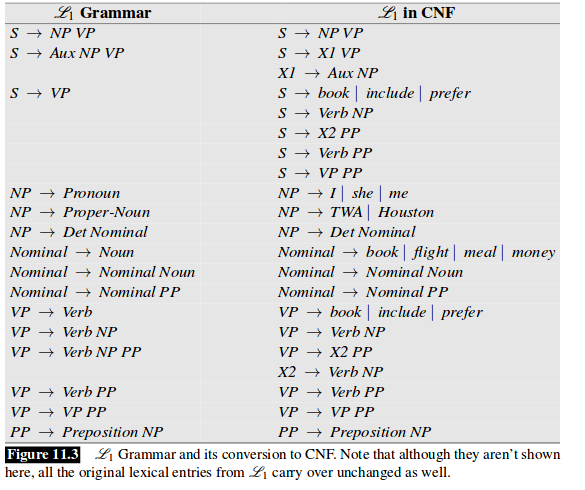

# Blind editor

Atividade ralizada para a cadeira de COMPILADORES - UFPB

Desenvolver um editor de texto onde os usuários são cegos.

A aplicação deve dar feedbacks para o usuário errors lexicos, sintáticos e semânticos.

# Como Rodar

Apenas abra o [index.html](index.html) no seu browser. E escreva a frase ou texto. Ao finalizar clique em 'tab' depois 'enter' paraque a análise comece.

Ao final da análise se houver alguma palavra errada, a parte errada vai estar selecionada para que o usuário faça a correção.

# Grupo

Aluno | Matrícula
-----| ----
Luiz Henrique | 11514334
Aline Moura | 
Alisson Galiza | 11408126
Rhenan Carvalho |

# Sobre o projeto:

Para facilitar o desenvolvimento, optamos por utilizar uma entrada em ingles

## Gramática

    S -> NP VP
       | VP

    NP -> Pronoun
        | Proper_noun
        | Determiner Adj Nominal
        | Adj Nominal

    Nominal -> Noun Nominal2

    Nominal2 -> PP Nominal2
              | ε

    VP -> Aux Verb Adv VP2
        | Verb NP Conj VP2
        | Verb NP PP VP2
        | Verb PP VP2
        | Verb VP2

    VP2 -> PP VP2
         | ε

    PP -> Preposition NP

    Adj -> Adjective
         | ε

    Adv -> Adverb
         | ε

    Conj -> Conjunction NP
          | ε

<!-- ## Gramática
 
[Explicações sobre a gramática utilizada](https://web.stanford.edu/~jurafsky/slp3/10.pdf)
 
 -->
 
## Limitações
Infelizmente, a **gramática utlizada** tem algumas limitações, entre elas:
 
- Precisa que a frase seja escrita por completo para só então comece a análise, pois estamos usando uma API para classificar as palavras (parte léxica), e esta é um pouco  lenta (uma requisição por palavra). Então a melhor maneira é apenas começar  análise depois que o texto for escrito.
- Verbos no futuro não estão sendo capturados
- Adjetivo só funciona entre determinantes e nominais
    - ex: the pretty girl
 
## TODO:
 
- Rever uma parte da grmática
- A frase `'I like dogs'` não funciona, mas `'I like the dogs'` sim. Isso se deve ao fato de a gramática não aceitar substantivosantecedidos por verbos (precisa de um  determinante entre eles, nesse caso o 'the')

 
<!-- - Teste automatico para as frases
    - it is raining
    - the book is on the table
    - the dog are sleeping
    - the dog is sleeping
    - the dogs are sleeping
    - the dogs is sleeping -->